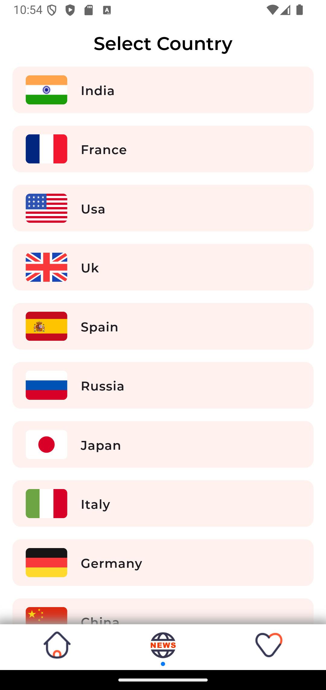
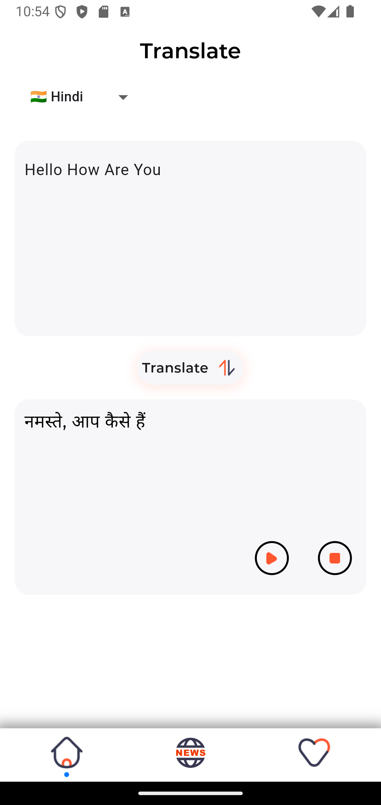

# news_app

## Some screenshots

|                                                        |                                                        |
| ------------------------------------------------------ | -------------------------------------------------------|
|  |  |
|   |   |

---

### :heart: Found this project useful?

If you found this project useful, then please consider giving it a :star: on Github and sharing it with your friends via social media.

#### for deploynment to github commands

## flutter clean

## flutter pub get

## flutter build web --release

## flutter build web --release --no-tree-shake-icons

## git init
## git remote set-url origin https://github.com/visheshasanadhya/newsApp.git
## git add .
## git commit -m "Force push entire Flutter project to main"
## git branch -M main
## git push -f origin main
